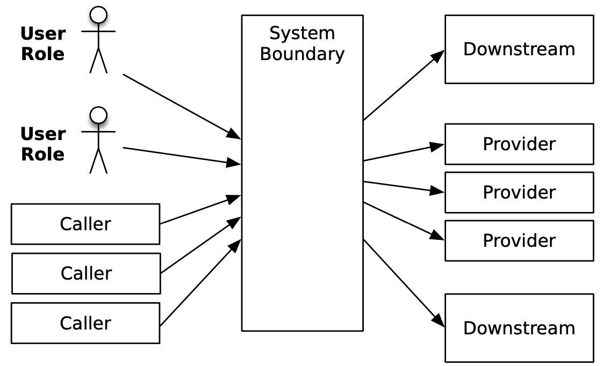

# Release it!
> Design and deploy production ready software

*by Michael T. Nygard*

## Chapter 1: 
## Living in Production
---
Does “feature complete” mean “production ready”? 

Software spends more time in production than in development.
  
## Aiming for the Right Target
Most software is designed for the development lab or the testers in the QA department.
  
When our system passes QA, can we say with confidence that it’s ready for production?
  
**Design For Production:** Design softwre to operate at low cost and high quality.

## The Scope of the Challenge

Building software fast that’s cheap to build, good for users, and cheap to operate demands continually improving architecture and design techniques.
  
## A Million Dollars Here, a Million Dollars There
Beware of systems which exhibit low availability, direct losses in missed revenue, and indirect losses through damage to the brand.
  
Make decisions that optimize development cost at the expense of operational cost only makes sense in the context of the team aiming for a **fixed budget and delivery date** (consultory?).
  
Design and architecture decisions are also financial decisions (implementation cost as well as their downstream costs).
  
 ## Use the Force
The earliest decisions you make can be the hardest ones to reverse later. The beginning is when your team is most ignorant of the eventual structure of the software, yet that’s when some of the most irrevocable decisions must be made

**Early delivery and incremental improvements** means software gets into production quickly.

## Pragmatic Architecture
Architect shall not just rub shoulders with the coders but be one.

Question all. “How can we do a deployment without rebooting the world?” “What metrics do we need to collect, and how will we analyze them?” “What part of the system needs improvement the most?”

---
### Part 1: Create Stability
---

## Chapter 2: 
## Case Study: The Exception That Grounded an Airline

Have you ever noticed that the incidents that blow up into the biggest issues start with something very small? A tiny programming error starts the snowball rolling downhill.

## The Change Window

Planned downtime to perform critical operations on the system. Team was trained and applied this change several times before this one. When concluded, change looked succesful.

## The Outage
Suddenly the system broke. 

Restoring service takes precedence over investigation. When the fur flies, improvisation is not your friend

The trick to restoring service is figuring out what to target. You can always “reboot the world” by restarting every single server, layer by layer. That’s almost always effective, but it takes a long time. 

## Consequences
You know it’s going to be a bad day when you see the CEO stalking around the operations center to find out who cost him his vacation home in St. Thomas.

## Postmortem
"You touched it last” turns out to be a good starting point most of the time.

- Did the last action cause the outage? If not, what did?
- Was the system configured correctly?
- Did the team conduct the actions correctly?
- How could the failure have been detected before it became an outage?
- Most importantly, how do we make sure this never, ever happens again?
  
Managing perception after a major incident can be as important as managing the incident itself

## Hunting for Clues
Stack-traces can be very helpful.

## The Smoking Gun
Relations can get strained due to the fear of blame. 

## An Ounce of Prevention?
Ultimately, it’s just fantasy to expect every single bug to be driven out. Bugs will happen. They cannot be eliminated, so they must be survived instead.

The worst problem here is that the bug in one system could propagate to all the other affected systems. **“How do we prevent bugs in one system from affecting everything else?”**

## Chapter 3:
## Stabilize Your System
---
Enterprise software must expects bad things to happen and is never surprised when they do. Doesn’t even trust itself. It refuses to get too intimate with other systems.

Poor stability carries significant real costs (lost revenue, bad reputation, ...). Decision points have high leverage over the system’s ultimate stability.

## Defining Stability
### Terms:
A ***transaction*** is an abstract unit of work processed by the system. It's not the same as a database transaction. In an e-commerce site, for example, one common type of transaction is “customer places order.” A single system can process just one type of transaction, making it a ***dedicated system***. A ***mixed workload*** is a combination of different transaction types processed by a system.

A ***system*** means the complete, interdependent set of hardware, applications, and services required to process transactions for users, from end to end.

A ***robust or stable system*** keeps processing transactions, even when failures disrupt normal processing.

An ***impulse*** is a rapid shock to the system and ***stress*** is a force applied to the system over an extended period.

A material changes shape when stress is applied. This change in shape is called the ***strain***. Stress produces strain.The stress from a component will cause strain to propagate to other parts of the system.

## Extending Your Life Span
The major dangers to your system’s longevity are memory leaks and data growth. Applications never run long enough in the development environment to reveal their longevity bugs. Dev environments are not conducive to long-running tests, such as leaving the server running for a month under daily traffic.

These sorts of bugs usually aren’t caught by load testing either. A load test runs for a specified period of time and then quits.

So how do you find these kinds of bugs? ***Longevity tests***. Don’t hit the system hard; just keep driving requests all the time. Simulate the slow period during the middle of the night (real world behavior).

## Failure Modes
Sudden impulses and excessive strain can both trigger catastrophic failure. A steel plate with a microscopic crack in the metal. Under stress, that crack can begin to propagate. Eventually, metal breaks. The original trigger and the way the crack spreads to the rest of the system, together with the result of the damage, are collectively called a ***failure mode***.

Once you accept that failures will happen, you have the ability to design your system’s reaction to specific failures. ***Crumple zones*** are safe failure modes that contain the damage and protect the rest of the system.

***Crackstoppers*** decide what features of the system are indispensable and build in failure modes that keep cracks away from those features.

## Stopping Crack Propagation
The more tightly coupled the architecture, the greater the chance this coding error can propagate.

## Chain of Failure
A failure in one point or layer actually increases the probability of other failures. Because the layers are coupled, the events are not independent.

Different chains of events:
- ***Fault.***  A condition that creates an incorrect internal state in your software.
- ***Error***. Visibly incorrect behavior.
- ***Failure***. An unresponsive system.
Triggering a fault opens the crack. Faults become errors, and errors provoke failures. That’s how the cracks propagate.

One way to prepare for every possible failure is to look at every external call, every I/O, every use of resources, and every expected outcome and ask, 
- What are all the ways this can go wrong? 
- What if it can’t make the initial connection?
- What if it takes ten minutes to make the connection?
- What if it can make the connection and then gets disconnected?
- What if it can make the connection but doesn’t get a response from the other end?
- What if it takes two minutes to respond to my query?
- What if 10,000 requests come in at the same time?
- What if the disk is full when the application tries to log the error message about the SQLException that happened because the network was bogged down with a worm?

## Wrapping Up

Over time, however, patterns of failure do emerge. A certain brittleness along an axis, a tendency for this problem to amplify that way. These are the stability ***antipatterns***.

***Patterns*** stop cracks from propagating. 

## Chapter 4: 
## Stability Antipatterns
---
Billons of users and boundaries of our applications have become fuzzy as more features are delegated to SaaS services.

The ***technology frontier*** is where the twin specters of high interactive complexity and tight coupling conspire to turn rapidly moving cracks into full-blown failures.

***High interactive complexity*** arises when systems have enough moving parts and hidden, internal dependencies that most operators’ **mental models** are either incomplete or just plain wrong. With the best of intentions, the developer can take an action based on his or her own mental model of how the system functions that triggers a completely unexpected linkage. Such linkages con- tribute to *****problem inflation*** turning a minor fault into a major failure. 

***Tight coupling*** allows cracks in one part of the system to propagate themselves —or multiply themselves—across layer or system boundaries

Simply avoiding antipatterns isn’t sufficient, though. Everything breaks. Faults are unavoidable.

## Integration Points
A ***butterfly*** (a.k.a monolith) has a central system with a lot of feeds and connections fanning into it on one side and a large fan out on the other side

A ***spiderweb***, with many boxes and dependencies, with calls
through tiers or simply chaos, any service calling each other. 

The more we move toward a large number of smaller services, the more we integrate with SaaS providers, and the more we go API first, the worse this is going to get

Integration points are the number-one killer of systems. Every socket, process, pipe, or remote procedure call can and will hang.

## Socket-Based Protocols
The calling system must deal with connection failures. But it can take a long time to discover that you can’t connect.

Supose the remote application's queue is listening to the port but is absolutely hammered with connection requests, until it can no longer service the incoming connections. The calling application’s thread could be blocked waiting for the remote server to respond for several minutes! (open() is blocked for every thread)

The same thing happens when the caller can connect and send its request but the server takes a long time to read the request and send a response. (read() call gets blocked).

*Connection Refused* is a fast failure but  Slow failures, such as a dropped ACK, let threads block for minutes before throwing exceptions. **The blocked thread can’t process other transactions**. If all threads end up getting blocked, then for all practical purposes, the server is down. Clearly, a **slow response is a lot worse than no response**.

## The 5 A.M. Problem
Abstractions provide great conciseness of expression. We can go much faster when we talk about fetching a document from a URL than if we have to discuss the tedious details of connection setup, packet framing, acknowledgments, receive windows, and so on. 

A network “connection” is a logical construct—an abstraction—in its own right. All you will ever see on the network itself are packets. (Of course, a “packet” is an abstraction, too.

Not every problem can be solved at the level of abstraction where it manifests. Sometimes the causes reverberate up and down the layers. You need to know how to drill through at least two layers of abstraction to find the “reality” at that level in order to understand problems.

## HTTP Protocols
HTTP-based protocols use sockets, so they are vulnerable to all of the problems described previously. Some of the ways that such an integration point can harm the caller:
- The provider may accept the TCP connection but never respond to the HTTP request.
- The provider may accept the connection but not read the request, causing caller's write buffer to block.
- The provider may send back a response status the caller doesn’t know how to handle.
- The provider may send back a response with a content type the caller doesn’t expect or know how to handle.
- The provider may claim to be sending some format but sending another.

Suggestion, treat a response as data until you’ve confirmed it meets your expectations.

## Vendor API Libraries
 You have so little control over them. We can’t tell what the execution context will be just by looking at the code.

 ## Countering Integration Point Problems
 The most effective stability patterns to combat integration point failures are **Circuit Breaker** and **Decoupling Middleware**. Testing helps, too. To make sure your software is cynical enough, you should make a **test harness** for each integration test:
- Canned respones for functional testing.
- Isolation.
- Simulate various kinds of system and network failures.

To test for stability, you also need to flip all the switches on the harness while the system is under considerable load

### Remember This
- **Beware this necessary evil.** Every integration point will eventually fail in some way, and you need to be prepared for that failure.
- **Prepare for the many forms of failure.** You will not get nice error responses delivered through the defined protocol; instead, you’ll see some kind of protocol violation, slow response, or outright hang.
- **Know when to open up abstractions.** Debugging integration point failures usually requires peeling back a layer of abstraction.
- **Failures propagate quickly.**
- **Apply patterns to avert integration point problems.** Defensive programming via Circuit Breaker, Timeouts, Decoupling Middleware and Handshaking.

## Chain Reactions
*Horizontal* scaling means we add capacity by adding more servers (a.k.a *farms*). *Vertical* scaling, means building bigger and bigger servers (adding core, memory, ...). 

In horizontal architecture, the multiplicity of machines provides you with fault tolerance through redundancy. But horizontal clusters are not susceptible to single points of failure. When one node in a load-balanced group fails, the other nodes must pick up the slack. If the first server failed because of some load-related condition, such as a memory leak or intermittent race condition, the surviving nodes become more likely to fail.

A chain reaction occurs when an application has some defect. That means the only way you can eliminate the chain reaction is to fix the underlying defect.

Chain reactions are sometimes caused by blocked threads.

### Remember This
- **Recognize that one server down jeopardizes the rest.**
- **Hunt for resource leaks.** Most of the time, a chain reaction happens when your application has a memory leak.
- **Hunt for obscure timing bugs.** Race conditions.
- **Use Autoscaling.** In the cloud using health-checks.
- Prevent chain reactions **partitioning servers with Bulkheads.**

## Cascading Failures
A cascading failure occurs when a crack in one layer triggers a crack in a calling layer. Every dependency is a chance for a failure to cascade. Crucial services with many callers—spread their problems widely. 

The failure “jumps the gap” between services when bad behavior in the calling layer gets triggered by the failure condition in the provider.

The layer-jumping mechanism often takes the form of failing threads (blocked or overly aggressive). Speculative retries also allow failures to jump the gap.

Preventing cascading failures is the very key to resilience. The most effective patterns to combat cascading failures are **Circuit Breaker** (for aggressive threads) and **Timeouts** (for blocked threads).

## Users
Users do present numerous risks to stability.

### Traffic
As traffic grows, it will eventually surpass your capacity. “Capacity” is the maximum throughput your system can sustain under a given workload while maintaining acceptable performance. 

### Heap Memory
One such hard limit is memory available. When memory gets short, a large number of surprising things can happen. If things are really bad, the logging system might not even be able to log the error. A supposedly recoverable low-memory situation will rapidly turn into a serious stability problem.

**Weak references** are a way to keep things in memory when memory is plentiful but automatically be more frugal when memory is tight. Weakly reachable objects will be reclaimed before an out-of-memory error occurs. Anyway, they do add complexity. So when you can, it’s best to just keep things out of the session.

### Off-Heap Memory, Off-Host Memory
Instead of keeping the session inside the heap, move it out to some other process. 

Redis is another popular tool for moving memory out of your process. It’s a fast “data structure server” that lives in a space between cache and database.

Anyway, local memory is still faster than remote memory. There’s no one-size-fits-all answer.

### Sockets
Every active request corresponds to an open socket. If there are only 64,511 ports available for connections, how can a server have a million connections? The secret is virtual IP addresses. Plan to spend some time learning about your operating system’s TCP tuning parameters.

### Closed Sockets
Not only can open sockets be a problem, but the ones you’ve already closed can bite you too. A *bogon* is a wandering packet that got routed inefficiently and arrives late, possibly out of sequence, and after the connection is closed.  If the socket were reused too quickly, then a bogon could arrive with the exact right com- bination of IP address, destination port number, and TCP sequence number to be accepted as legitimate data for the new connection. 

### Expensive to Serve
Expensive users are not a direct stability risk, but the increased stress they produce increases the likelihood of triggering cracks elsewhere in the system

The best thing you can do about expensive users is test aggressively. Identify whatever your most expensive transactions are and double or triple the proportion of those transactions.

Build the system to handle nothing but the most expensive trans- actions and you will spend ten times too much on hardware.

### Unwanted Users
We would all sleep easier if the only users to worry about were the ones handing us their credit card numbers. Some aren’t deliberately malicious; but there are others that do it on purpose.

Keeping out legitimate robots is fairly easy through the use of the robots.txt file. In the worst case, the site sends the agent into a dead end. The robots most likely to respect robots.txt are the ones that might actually generate traffic (and revenue) for you, while the leeches ignore it completely.

Once you identify a screen scraper, block it from your network (using CDN, firewalls, ...).

### Malicious Users
This gets into deep waters with respect to law enforcement and forensic evidence.

The primary risk to stability is the now-classic distributed denial-of-service (DDoS) attack. The load typically comes from a botnet.

Network vendors all have products that detect and mitigate DDoS attacks. Proper configuring and monitoring of these products is essential. It’s best to run these in “learning” or “baseline” mode for at least a month to understand what your normal, cyclic traffic patterns are.

### Remember This
- **Users consume memory.** Each user’s session requires some memory. Minimize that memory to improve your capacity. 
- **Users do weird, random things.** Users in the real world do things that you won’t predict. If there’s a weak spot in your application, they’ll find it through sheer numbers. 
- **Malicious users are out there.** Become intimate with your network design; Make sure your systems are easy to patch.
- **Users will gang up on you.** Run special stress tests to hammer deep links or hot URLs. Watch out for huge loads.

## Blocked Threads
The process runs and runs but does nothing because every thread available for processing transactions is blocked waiting on some impossible outcome.
 - “the system crashed" VS “the system is hung.”

Only one observable variable really matters, **whether the system is able to process transactions or not.**. The simple fact that the server process is running doesn’t help the user get work done

Usefull monitoring:
- A mock client running synthetic transactions on a regular basis.
- Metrics (succesful logins, failed credit cards, ...).
  
It’s very, very hard to find hangs during development

Avoid synchronization on domain objects making your domain objects immutable and using CQRS.

### Use Caching, Carefully
The maximum **memory usage** of all application-level caches should be **configurable**. By consuming memory needed for other tasks, the cache will actually cause a serious slowdown.

**Monitor hit rates for the cached items** to see whether most items are being used from cache. If a particular cached object is used only once during the lifetime of a server, then caching it is of no help.

Is wise to avoid caching things that are cheap to generate.

Caches that use **weak references** will help the garbage collector reclaim memory instead of preventing it.

### Libraries

Libraries are notorious sources of blocking threads which usually never allow you to configure their failure modes.

### Remember This
- The Blocked Threads antipattern leads to Chain Reactions and Cascading Failures antipatterns.
- A deadlock in the database can cause connections to be lost forever, blocking the thread.
- Any library of concurrency utilities has more testing than your newborn queue.
- Defend with Timeouts.
- Beware the code you cannot see. Prefer open source libraries to closed source, to invesitgate its guts and test it.

## Self-Denial Attacks

A **self- denial attack** describes any situation in which the system—or the extended system that includes humans—conspires against itself. For example, thousands of requests, origined by an special offer, made against single node acting as a bottleneck.

### Avoiding Self-Denial

You can avoid machine-induced self-denial by building a “**shared-nothing**” architecture (when each server can run without knowing anything about any other server). Where that’s impractical, apply decoupling middleware to reduce the impact of excessive demand, or make the shared resource itself horizontally scalable.

Autoscaling can help when the traffic surge does arrive, but watch out for the lag time. “Pre-autoscale” by upping the configuration before the marketing event goes out.

### Rememeber this

- Keep the lines of communication open.
- Protect/scale shared resources.
- Expect rapid redistribution of any cool or valuable offer.

## Scaling Effects
Anytime you have a “many-to-one” or “many-to-few” relationship, you can be hit by scaling effects when one side increases.

### Point-to-Point Communications
With point-to-point connections, each instance has to talk directly to every other instance. It probably works just fine when only one or two instances are communicating.

The total number of connections goes up as the square of the number of instances. Scale that up to a hundred instances, and the O(n^2) scaling becomes quite painful.

**Distinguish** between point-to-point **inside a service** versus point-to-point **between services**. 

As the number of servers grows, then a different communication strategy is needed:
- UDP broadcasts (bandwith inefficient, because sending to everybody).
  
- TCP or UDP multicast (more efficient, as the sender chooses where to send).
  
- Publish/subscribe messaging (better, since a server can pick up a message even if it wasn’t listening at the precise moment the message was sent. Higher infrastructure cost)
  
- Message queues

### Shared Resources

Shared resource is some facility that all members of a horizontally scalable layer need to use. When the shared resource gets overloaded, it’ll become a **bottleneck** limiting capacity

### Remember This
- Examine production versus QA environments to spot Scaling Effects.
- Watch out for point-to-point communication.
- Watch out for shared resources.

## Unbalanced Capacities
One system can overwhelm another if their capacities are not balanced. But id might be impractical to evenly match capacity in each system for a lot of reasons. You must build both callers and providers to be resilient in the face of a tsunami of requests instead.
- For the caller, Circuit Breaker can work.
- For service providers, use Handshaking and Backpressure to inform callers to throttle back on the requests. Also consider Bulkheads to reserve capacity for high-priority callers of critical services.

### Drive Out Through Testing
Unbalanced capacities are another problem rarely observed during QA. You can apply a **test harness** mimicking a back-end system wilting under load to verify that your front-end system **degrades gracefully**.

- Use capacity modeling to make sure you’re at least in the ballpark.
- Don’t just test your system with your usual workloads. Double your usual load and direct it all against your most expensive transaction.
- Use autoscaling to react to surging demand (watch out with costs).

## Dogpile
After recovering from a shutdown, we have to take care, because another overload when the "power" is still low gut trigger another shutdown.

Startup power needs can be higher than the usual steady load. When a bunch of servers impose this transient load all at once, it’s called a dogpile It can happen:
- When booting up several servers, such as after a code upgrade and restart.
- When a cron job triggers at midnight (or on the hour for any hour, really).
- When the configuration management system pushes out a change.

Prevent dogpiles configuring a randomized “slew” that will cause servers to pull changes at slightly different times. Look out for any place where many threads can get blocked waiting for one thread to complete.

### Remember This
- Dogpiles force you to spend too much to handle peak demand..
- Use random clock slew to diffuse the demand.
- Use increasing backoff times to avoid pulsing.

## Force Multiplier
Automation allows administrators to make large movements with less effort. It’s a force multiplier.

### Outage Amplification

For example, a service is responsible for starting and stopping machine instances. If it forms a belief that everything is down, then it would necessarily start a new copy of every single service required to run the enterprise.

### Controls and Safeguards

 Limiting capabalities when the system is not operating in a “normal” condition.
 - If observations report that more than 80 percent of the system is unavailable, it’s more likely to be a problem with the observer than the system.
 - Apply **hysteresis**. Start machines quickly, but shut them down slowly.
 - Systems that consume resources should be stateful enough to detect if they’re trying to spin up infinity instances.
 - Build in deceleration zones to account for momentum. Suppose your control plane senses excess load every second, but it takes five minutes to start a virtual machine to handle the load. It must make sure not to start 300 virtual machines because the high load persists

### Remember This
- Build limiters and safeguards into infrastructure management tools so they won’t destroy your whole system at once.
- Actions initiated by automation take time. That time is usually longer than a monitoring interval, so make sure to account for some delay in the system’s response to the action.
  
## Slow Responses
Generating a slow response is worse than refusing a connection or returning an error. Slow responses usually result from excessive demand. 

Slow responses tend to propagate upward from layer to layer in a gradual form of cascading failure.

The system should have the ability to monitor its own performance, so it can also tell when it isn’t meeting its service-level agreement.

### Remember This
- Slow Responses trigger Cascading Failures.
- For websites, Slow Responses cause more traffic. (users reloading the page when the response is slow).
- Consider Fail Fast.
- Hunt for memory leaks or resource contention.

## Unbounded Result Sets
Ask, “What can system X do to hurt me?” and then design a way to dodge whatever wrench your supposed ally throws.

### Remember this
- Use production-sized data sets for testing.
- Paginate at the front end.
- Don’t rely on the data producers.
- Put limits into other application-level protocols which can return to huge data collections, consuming too much memory.

## Chapter 5:
## Stability Patterns
---
