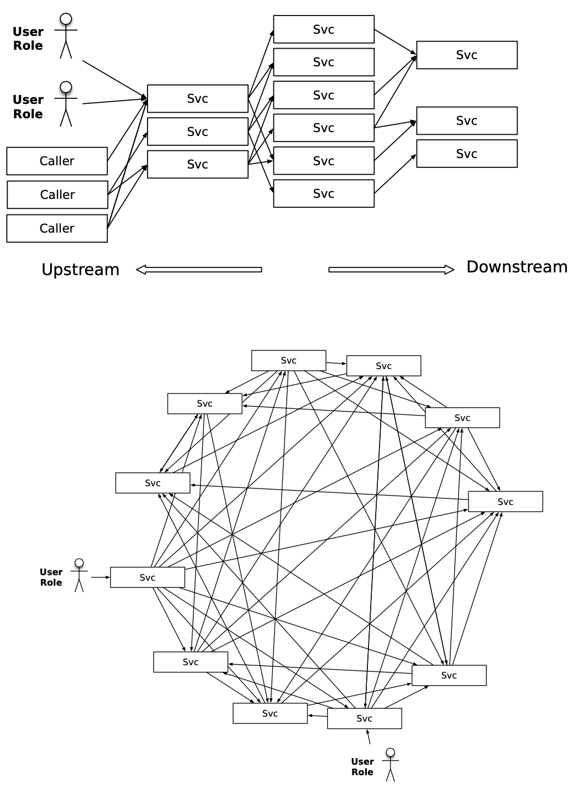

# Release it!
> Design and deploy production ready software

*by Michael T. Nygard*

## Chapter 1: 
## Living in Production
---
Does “feature complete” mean “production ready”? 

Software spends more time in production than in development.
  
## Aiming for the Right Target
Most software is designed for the development lab or the testers in the QA department.
  
When our system passes QA, can we say with confidence that it’s ready for production?
  
**Design For Production:** Design softwre to operate at low cost and high quality.

## The Scope of the Challenge

Building software fast that’s cheap to build, good for users, and cheap to operate demands continually improving architecture and design techniques.
  
## A Million Dollars Here, a Million Dollars There
Beware of systems which exhibit low availability, direct losses in missed revenue, and indirect losses through damage to the brand.
  
Make decisions that optimize development cost at the expense of operational cost only makes sense in the context of the team aiming for a **fixed budget and delivery date** (consultory?).
  
Design and architecture decisions are also financial decisions (implementation cost as well as their downstream costs).
  
 ## Use the Force
The earliest decisions you make can be the hardest ones to reverse later. The beginning is when your team is most ignorant of the eventual structure of the software, yet that’s when some of the most irrevocable decisions must be made

**Early delivery and incremental improvements** means software gets into production quickly.

## Pragmatic Architecture
Architect shall not just rub shoulders with the coders but be one.

Question all. “How can we do a deployment without rebooting the world?” “What metrics do we need to collect, and how will we analyze them?” “What part of the system needs improvement the most?”

---
### Part 1: Create Stability
---

## Chapter 2: 
## Case Study: The Exception That Grounded an Airline

Have you ever noticed that the incidents that blow up into the biggest issues start with something very small? A tiny programming error starts the snowball rolling downhill.

## The Change Window

Planned downtime to perform critical operations on the system. Team was trained and applied this change several times before this one. When concluded, change looked succesful.

## The Outage
Suddenly the system broke. 

Restoring service takes precedence over investigation. When the fur flies, improvisation is not your friend

The trick to restoring service is figuring out what to target. You can always “reboot the world” by restarting every single server, layer by layer. That’s almost always effective, but it takes a long time. 

## Consequences
You know it’s going to be a bad day when you see the CEO stalking around the operations center to find out who cost him his vacation home in St. Thomas.

## Postmortem
"You touched it last” turns out to be a good starting point most of the time.

- Did the last action cause the outage? If not, what did?
- Was the system configured correctly?
- Did the team conduct the actions correctly?
- How could the failure have been detected before it became an outage?
- Most importantly, how do we make sure this never, ever happens again?
  
Managing perception after a major incident can be as important as managing the incident itself

## Hunting for Clues
Stack-traces can be very helpful.

## The Smoking Gun
Relations can get strained due to the fear of blame. 

## An Ounce of Prevention?
Ultimately, it’s just fantasy to expect every single bug to be driven out. Bugs will happen. They cannot be eliminated, so they must be survived instead.

The worst problem here is that the bug in one system could propagate to all the other affected systems. **“How do we prevent bugs in one system from affecting everything else?”**

## Chapter 3:
## Stabilize Your System
Enterprise software must expects bad things to happen and is never surprised when they do. Doesn’t even trust itself. It refuses to get too intimate with other systems.

Poor stability carries significant real costs (lost revenue, bad reputation, ...). Decision points have high leverage over the system’s ultimate stability.

## Defining Stability
### Terms:
A ***transaction*** is an abstract unit of work processed by the system. It's not the same as a database transaction. In an e-commerce site, for example, one common type of transaction is “customer places order.” A single system can process just one type of transaction, making it a ***dedicated system***. A ***mixed workload*** is a combination of different transaction types processed by a system.

A ***system*** means the complete, interdependent set of hardware, applications, and services required to process transactions for users, from end to end.

A ***robust or stable system*** keeps processing transactions, even when failures disrupt normal processing.

An ***impulse*** is a rapid shock to the system and ***stress*** is a force applied to the system over an extended period.

A material changes shape when stress is applied. This change in shape is called the ***strain***. Stress produces strain.The stress from a component will cause strain to propagate to other parts of the system.

## Extending Your Life Span
The major dangers to your system’s longevity are memory leaks and data growth. Applications never run long enough in the development environment to reveal their longevity bugs. Dev environments are not conducive to long-running tests, such as leaving the server running for a month under daily traffic.

These sorts of bugs usually aren’t caught by load testing either. A load test runs for a specified period of time and then quits.

So how do you find these kinds of bugs? ***Longevity tests***. Don’t hit the system hard; just keep driving requests all the time. Simulate the slow period during the middle of the night (real world behavior).

## Failure Modes
Sudden impulses and excessive strain can both trigger catastrophic failure. A steel plate with a microscopic crack in the metal. Under stress, that crack can begin to propagate. Eventually, metal breaks. The original trigger and the way the crack spreads to the rest of the system, together with the result of the damage, are collectively called a ***failure mode***.

Once you accept that failures will happen, you have the ability to design your system’s reaction to specific failures. ***Crumple zones*** are safe failure modes that contain the damage and protect the rest of the system.

***Crackstoppers*** decide what features of the system are indispensable and build in failure modes that keep cracks away from those features.

## Stopping Crack Propagation
The more tightly coupled the architecture, the greater the chance this coding error can propagate.

## Chain of Failure
A failure in one point or layer actually increases the probability of other failures. Because the layers are coupled, the events are not independent.

Different chains of events:
- ***Fault.***  A condition that creates an incorrect internal state in your software.
- ***Error***. Visibly incorrect behavior.
- ***Failure***. An unresponsive system.
Triggering a fault opens the crack. Faults become errors, and errors provoke failures. That’s how the cracks propagate.

One way to prepare for every possible failure is to look at every external call, every I/O, every use of resources, and every expected outcome and ask, 
- What are all the ways this can go wrong? 
- What if it can’t make the initial connection?
- What if it takes ten minutes to make the connection?
- What if it can make the connection and then gets disconnected?
- What if it can make the connection but doesn’t get a response from the other end?
- What if it takes two minutes to respond to my query?
- What if 10,000 requests come in at the same time?
- What if the disk is full when the application tries to log the error message about the SQLException that happened because the network was bogged down with a worm?

## Wrapping Up

Over time, however, patterns of failure do emerge. A certain brittleness along an axis, a tendency for this problem to amplify that way. These are the stability ***antipatterns***.

***Patterns*** stop cracks from propagating. 

## Chapter 4: 
## Stability Antipatterns

Billons of users and boundaries of our applications have become fuzzy as more features are delegated to SaaS services.

The ***technology frontier*** is where the twin specters of high interactive complexity and tight coupling conspire to turn rapidly moving cracks into full-blown failures.

***High interactive complexity*** arises when systems have enough moving parts and hidden, internal dependencies that most operators’ **mental models** are either incomplete or just plain wrong. With the best of intentions, the developer can take an action based on his or her own mental model of how the system functions that triggers a completely unexpected linkage. Such linkages con- tribute to *****problem inflation*** turning a minor fault into a major failure. 

***Tight coupling*** allows cracks in one part of the system to propagate themselves —or multiply themselves—across layer or system boundaries

Simply avoiding antipatterns isn’t sufficient, though. Everything breaks. Faults are unavoidable.

## Integration Points
A ***butterfly*** (a.k.a monolith) has a central system with a lot of feeds and connections fanning into it on one side and a large fan out on the other side

A ***spiderweb***, with many boxes and dependencies, with calls
through tiers or simply chaos, any service calling each other. 

The more we move toward a large number of smaller services, the more we integrate with SaaS providers, and the more we go API first, the worse this is going to get

Integration points are the number-one killer of systems. Every socket, process, pipe, or remote procedure call can and will hang.

## Socket-Based Protocols
The calling system must deal with connection failures. But it can take a long time to discover that you can’t connect.

Supose the remote application's queue is listening to the port but is absolutely hammered with connection requests, until it can no longer service the incoming connections. The calling application’s thread could be blocked waiting for the remote server to respond for several minutes! (open() is blocked for every thread)

The same thing happens when the caller can connect and send its request but the server takes a long time to read the request and send a response. (read() call gets blocked).

*Connection Refused* is a fast failure but  Slow failures, such as a dropped ACK, let threads block for minutes before throwing exceptions. **The blocked thread can’t process other transactions**. If all threads end up getting blocked, then for all practical purposes, the server is down. Clearly, a **slow response is a lot worse than no response**.

## The 5 A.M. Problem
Abstractions provide great conciseness of expression. We can go much faster when we talk about fetching a document from a URL than if we have to discuss the tedious details of connection setup, packet framing, acknowledgments, receive windows, and so on. 

A network “connection” is a logical construct—an abstraction—in its own right. All you will ever see on the network itself are packets. (Of course, a “packet” is an abstraction, too.

Not every problem can be solved at the level of abstraction where it manifests. Sometimes the causes reverberate up and down the layers. You need to know how to drill through at least two layers of abstraction to find the “reality” at that level in order to understand problems.

## HTTP Protocols
